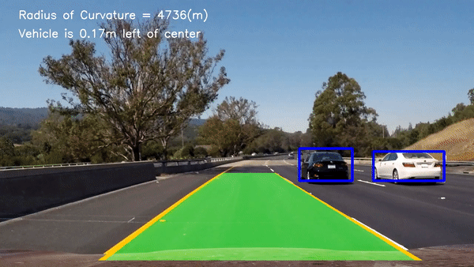
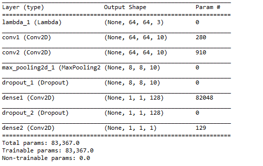
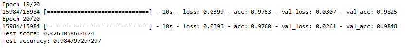
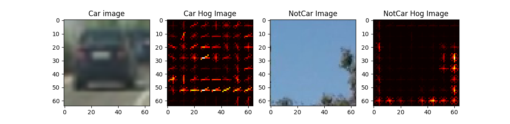
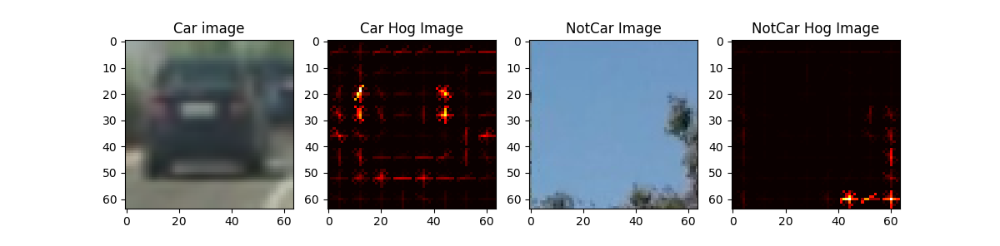
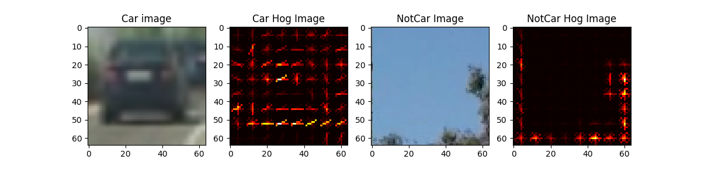
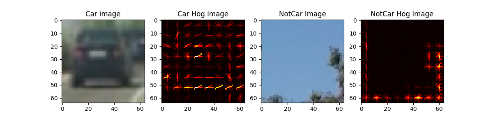
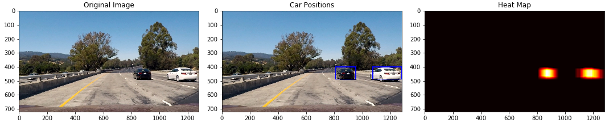

# Project 5: Vehicle Detection and Tracking

The goal of this project is to detect cars and track those vehicles throughout the video. Non-vehicle and vehicle images were trained using a neural network. Advanced Lane Detection and Vehicle Detection/Tracking projects are combined here. Since a custom neural network is used feature selections are done by the model. 

- Test Video Result:

  
 
- [Project Video](https://www.youtube.com/watch?v=Qn0w2xHP8U0)

## Table of Contents ##
- [Project codes](#codes)
- [Data Information](#data)
- [Model](#model)
- [Pipeline](#pipeline)
- [Discussion](#discussion)
- [References](#references)

## Project codes 
- vehicle_detection_tracking.py -- vehicle and non-vehicle data training also tracking vehicles.  
- video_generation.py -- processing video frames 
- laneheper.py,LaneDetector.py, Line.py -- helper functions for lane detection
- ImageUtils.py -- image processing functions
- vehicle_helper.py -- feature extraction and visuals 

## Data Information 
 **(64x64x3)** vehicle and non-vehicle images are used for training and 10% of data is allocated for testing. Here is data summary:

	Training Data Size = 15984

	Test Data Size = 1776

	Shape of image = (64, 64, 3)

## Model 

First images are normalized followed by two 2D Convolution layers then max_pooling. Right after 50% of data is dropped between dense layers. Model image is shown below. 

## Pipeline 

Setting epoch=20 and batch_size=32, test accuracy is ~0.985 with 0.026 loss. For the last two epoch results are given below. 

### Histogram of Oriented Gradients (HOG):

Parameters are kept the same while different color spaces explored to find out which one gives the best result. 

**orientation: 6**

**pixel per cell: 8**

**cell per block: 2**

- RGB Color Space:

 

- HSV Color Space:

- LUV Color Space

   

- HLS Color Space

- YUV Color Space

   

- YCrCb Color Space

    

Looking at the color spaces YCrCb seems that it gives better gradient 

### Training:

For training data Support Vector Machine (Linear) model is used for training the data but before that the mean and standard deviation is computed using StandardScaler module from sklearn. So, this eliminates a feature dominating which hinders the learning. 

Restricting sampling size to 1000 images of cars and noncars helped to decide on which parameters gave better results. Initial training i kept the parameters as default.

Color Space : RGB

Orientation : 6

Pixel Per Cell : 8

Cell Per Block : 2

Hog Channel: 0

Histogram Bins : 16

Spatial Sampling Size : (16,16)

Feature Vector Size : 1992

**Test Accuracy of SVC : 0.945**

For the other training i modified parameters below and the accuracy got much better. 

Color Space : YCrCb

Orientation : 9

Pixel Per Cell : 8

Cell Per Block : 2

Hog Channel: ALL

Histogram Bins : 32

Spatial Sampling Size : (32,32)

Feature Vector Size : 8460

**Test Accuracy of SVC : 0.985**

	def vehicleDetectionTracking(self) function in video_generation.py trains the data and produces hog images.  

**Note: Since a deep learning algorithm is used for finding out features this portion is not essential for the car detection but it is required by the project.**

### Sliding Window Search:

Deep learning accuracy is about 0.985 which means that there is still false positive regions not car related also there will be some regions that overlapping with other windows. These issues are addressed by restricting search into an area where cars will be present and the second issue is resolved by retrieving min and max values of heatmap boxes.

	def add_heat(self,heatmap, x,y)
	def draw_labeled_bboxes_test(self,img, labels)

two functions in vehicle_detection_tracking.py addresses the issues discussed above. 

### Heatmap:
test1.jpeg is used for heatmap and detecting the cars in the image.  

For video generation Advanced Lane Detection code and this project are combined for both detecting the lane lines also for car detection/tracking. 

### Video Generation:

The full operation is orchestrated by video_generation.py which include all the default parameter definition and inherits from other classes. 

Line (180-184) in video_generation.py

    gv = generateVideo(args)
    gv.calibration()
    gv.generate_binary_image()
    gv.generate()

the code above is responsible for initiating the video generation flow. 

## Discussion 

One of the challenges in the project was restricting heatmap to an area where cars will be available. When i didn't restricted trees and road signs were also detected. Also, the cars coming from other side of the road were detected. I noticed that size of the box keeps changing during the video process that needs to be improved.

## References 

1. [Udacity Self-Driving Car Class Materials](https://classroom.udacity.com/nanodegrees/nd013/parts/fbf77062-5703-404e-b60c-95b78b2f3f9e)
2. [Self-Driving Car Project Q&A](https://www.youtube.com/watch?v=P2zwrTM8ueA&feature=youtu.be&utm_medium=email&utm_campaign=2017-05-24_carnd_projectwalkthroughs&utm_source=blueshift&utm_content=2017-05-24_carnd_projectwalkthroughs&bsft_eid=809c46b1-7b0f-4960-9cc1-459c102110d5&bsft_clkid=d5c545c7-51a9-4ad1-b183-8df98e93bfce&bsft_uid=6462eace-49a4-468f-a7d8-d25690fd3bfa&bsft_mid=b9348cc6-ddd2-408e-9441-aa9a1302ad86)
3. [GitHub Link](https://github.com/HTuennermann/Vehicle-Detection-and-Tracking)